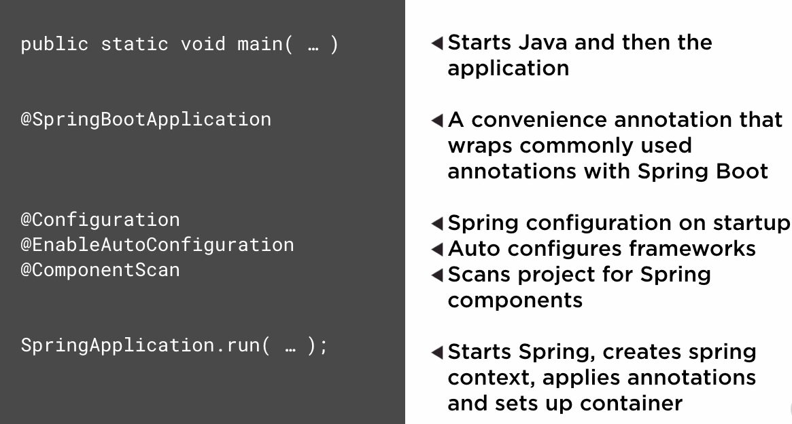

<!-- START doctoc generated TOC please keep comment here to allow auto update -->
<!-- DON'T EDIT THIS SECTION, INSTEAD RE-RUN doctoc TO UPDATE -->
**Table of Contents**  *generated with [DocToc](https://github.com/thlorenz/doctoc)*

- [Spring Boot](#spring-boot)
  - [First Spring Boot Project](#first-spring-boot-project)
    - [Demo: Creating a Spring Boot App](#demo-creating-a-spring-boot-app)
    - [Learning Path for Spring Boot](#learning-path-for-spring-boot)
    - [Spring Boot Dependency Management](#spring-boot-dependency-management)
    - [Other Spring Boot Initializers](#other-spring-boot-initializers)
    - [How Does Spring Boot Work?](#how-does-spring-boot-work)

<!-- END doctoc generated TOC please keep comment here to allow auto update -->

# Spring Boot

> My notes from [Spring Boot](https://app.pluralsight.com/library/courses/spring-boot-first-application/description) course on Pluralsight.

## First Spring Boot Project

### Demo: Creating a Spring Boot App

Prerequisites:

- Java 1.8
- Maven
- IDE (Spring STS, IntelliJ)

In this demo, will manually scaffold a spring boot app. Start a new Maven project in IDE, then pick Maven archetype "Quickstart".

With Spring Boot, run plain old Java program (`public static void main...`) rather than using a container.

Add `@SpringBootApplication` to top of class to enable spring boot. This annotation scans project for Spring components, and auto-wires up most of Spring libraries by enabling auto-configuration.

To fire up Spring Boot

```java
public static void main( String[] args ) {
  SpringApplication.run(App.class, args);
}
```

Then simply run the app as a java application. This starts up Tomcat at [http://localhost:8080](http://localhost:8080).

### Learning Path for Spring Boot

[Spring Reference](http://spring.io)

Other courses:

* Spring Fundamentals
* Spring Security Fundamentals
* Spring with JPA nad Hibernate
* Getting Started with Spring Data JPA/REST

### Spring Boot Dependency Management

Intelligent collection of dependencies are called: BOM - bill of materials.

Matches up which versions of libraries/frameworks work well with each other. Example spring-core 4.2.3 works well with logback-core 1.1.3.

How does BOM work? Starts with `<parent>` dependency in pom.xml, which brings in all the dependency management.

```xml
<parent>
  <groupId>org.springframework.boot</groupId>
  <artifactId>spring-boot-starter-parent</artifactId>
  <version>1.3.1.RELEASE</version>
</parent>
```

Starter parent also sets up other defaults such as plugins, min java version, resource filtering, etc.
Parent declaration does a lot of heavy lifting.

### Other Spring Boot Initializers

Besides manually scaffolding a spring boot app, there are several other options:

[Web Initializer](http://start.spring.io)  Switch to full version to see all libraries and frameworks that you can integrate with your project.

[Spring boot CLI](http://docs.spring.io/spring-boot/docs/current/reference/html/getting-started-installing-spring-boot.html#getting-started-homebrew-cli-installation) - same back end api that web initializer uses.

To verify its working `$ spring --version`.

To create a new application `$ spring init --dependencies=web myNewApp`.

[Clone an example](https://github.com/spring-projects/spring-boot/tree/master/spring-boot-samples) But they usually only show one integration with one framework.

### How Does Spring Boot Work?

First, application is started from Java main class.

Next, Spring Boot initializes the spring context that comprises your spring app, and honours any auto-config initializers, configuration and annotations that direct how to initialize and start up the spring context.

Last, an embedded server container is started and auto-configured. This is why no need for web.xml. Tomcat is the default servlet container but it can be swapped out with Jetty or change config options such as server port.



`@SpringBootApplication` under the covers sets up other annotations so you don't need to write them all out by hand, they are:

`@Configuration`: Classifies this java class as a configuration for the spring context that spring boot and spring use to initialize and configure components and environment settings used by Spring. This is equivalent to the older xml based spring configurations.

`@EnableAutoConfiguration`: Spring-boot specific annotation. If it finds any spring sub-projects or other spring-compatible frameworks on the classpath, it should attempt to auto-configure them and get them wired up and integrated automatically with Spring. This does a lot of the "magic" of Spring boot, which makes setting up a full Java stack app easy.

`@ComponentScan`: Tells spring boot and spring to look for any spring components such as controllers, services, repositories or any other spring components starting in the main app package, and recursively looking through all sub-packages from there. Recommended to keep main App class at top level of package, so everything else in project can be found by `@ComponentScan`.

Static `SpringApplication.run(...)` method initializes spring context, applies all annotation and configuration classes, searches for any spring components and places them in the spring context, and setsup and configures the embedded container.

### Why Move to Containerless Deployments?

With a container, need to:

* container needs to be setup and configured for each environment
* Need to use files like web.xml to tell container how to work
* Environment configuration is external to the app

With containerless:

* Runs anywhere Java is setup
